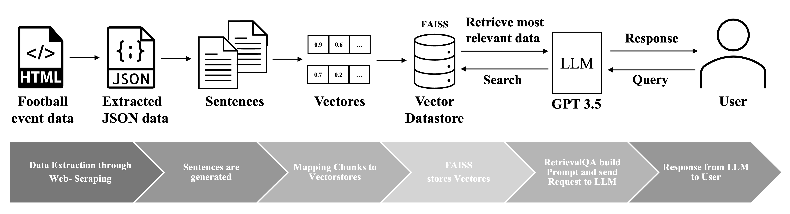

# Querying Football Matches for Event Data: Towards using Large Language Models

The data is sourced from the platform Understat.com, which provides detailed
football data for every match in the top European leagues since the 2014/2015
season. In addition to simple match statistics, Understat also offers comprehensive and detailed information on individual players and events in games. We
use web scraping techniques to extract the essential data from the platform.
Therefore, we used various Python libraries to create the web scraper. Our generated data is a result of mapping these features and composing new sentences
to comprehend the events of the match.

We utilize GPT 3.5 through ChatGPT as the LLM in our approach. In addition,
LangChain is used, which has emerged as an effective approach in NLP research, to retrieve information from our data framework using the GPT
3.5 model. Using LangChain as a framework, different technologies can be abstracted, and we are able to link the LLM prompts to each other. This allows
us to better utilize question answering and text generation for LLM.
One of the components of LangChain is the “text splitter”, which is responsible for breaking down large pieces of text into segments that can be processed by
the LLM. The splitting is done by creating chunks smaller than 512 letters.
An embedding function was initialized to convert the generated chunk text data
into vectors and redirect them to the Facebook AI Similarity Search (FAISS).
FAISS offers an efficient way to quickly identify data information in large vector
datasets that are similar to each other and functions as an in-memory index that
does not persist data across sessions.

In our case, FAISS stores and manages the embedded chunks of our football event data in vector form. The RetrievalQA chain, a component of the
LangChain framework, uses the vectorized data stored in FAISS to perform
retrieval-augmented generation. When a query is submitted, the RetrievalQA
chain retrieves the most relevant data from the vector store and builds a prompt. The LLM then uses this data to generate accurate and contextually relevant
responses for the user.

# Packages:
beautifulsoup4, requests, jsonschema, langchain, lxml, pandas, numpy, tiktoken, openai, python-dotenv

# Usage:
To use the code the OpenAI environment key must be entered into the variable "OPENAI_API_KEY".

After that the usage can be done by executing all the cells in their order.

The questions to ask can be entered in the variable "querys".

# Authors:
Alexander Schilling, James Anurathan, Johannes Muehlberger,
Felix Gerschner, Manfred Roessle, Andreas Theissler and Marco Klaiber
